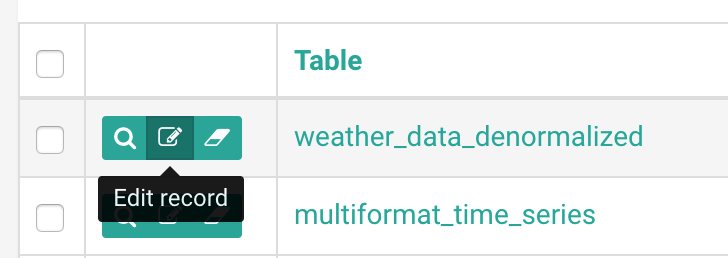
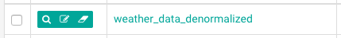
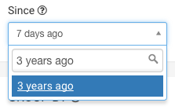
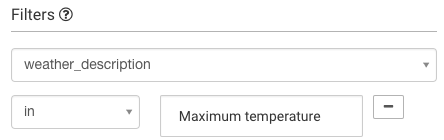
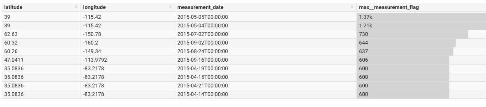
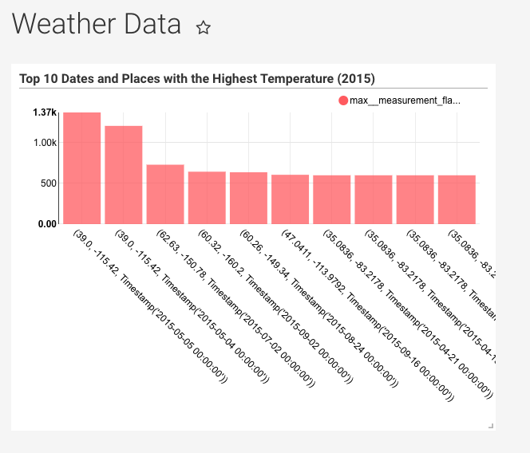

..  Licensed to the Apache Software Foundation (ASF) under one
    or more contributor license agreements.  See the NOTICE file
    distributed with this work for additional information
    regarding copyright ownership.  The ASF licenses this file
    to you under the Apache License, Version 2.0 (the
    "License"); you may not use this file except in compliance
    with the License.  You may obtain a copy of the License at

..    http://www.apache.org/licenses/LICENSE-2.0

..  Unless required by applicable law or agreed to in writing,
    software distributed under the License is distributed on an
    "AS IS" BASIS, WITHOUT WARRANTIES OR CONDITIONS OF ANY
    KIND, either express or implied.  See the License for the
    specific language governing permissions and limitations
    under the License.

创建您的第一个看板
=============================

本教程的目标读者是希望在 Superset 中创建图表和看板的人。
我们将向您展示如何将 Superset 连接到一个新数据库并在该数据库中配置一个表以进行分析。
您还将研究公开的数据，并将可视化添加到看板中，以获得端到端用户体验的感觉。

连接到新数据库
----------------------------

我们假设您已经配置了一个数据库，并且可以从运行 Superset 的实例连接到它。
如果您只是测试 Superset 并希望研究示例数据，您可以将一些`示例 PostgreSQL 数据集<https://wiki.postgresql.org/wiki/Sample_Databases>`_加载到一个新的数据库中，
或者配置我们在这里使用的`示例天气数据 <https://github.com/dylburger/noaa-ghcn-weather-data>`_。

在 **Sources** 菜单下，选择 *Databases* 选项:

在结果页面上，单击右上角的绿色加号:

您可以在这个页面上配置许多高级选项，但是对于本演练，您只需要做**两件事**:

1. 命名您的数据库连接:

2. 提供 SQLAlchemy 连接 URI 并测试连接:

.. image:: images/tutorial/tutorial_04_sqlalchemy_connection_string.png
   :scale: 70%

这个例子显示了测试天气数据库的连接字符串。正如 URI 下面的文本中所指出的，
您应该参考 SQLAlchemy 文档，了解如何为目标数据库`创建新的连接 URI<https://docs.sqlalchemy.org/en/rel_1_2/core/engines.html#database-urls>`_。

单击 **Test Connection** 按钮，确认端到端工作的内容。一旦 Superset 可以成功连接和认证，
你应该看到这样的弹出窗口:

.. image:: images/tutorial/tutorial_05_connection_popup.png
   :scale: 50%

此外，你还应该看到 Superset 可以从你连接的 schema 中读取的表列表，在页面的底部:

.. image:: images/tutorial/tutorial_06_list_of_tables.png
   :scale: 70%

如果连接看起来正常，点击页面底部的 **Save** 按钮保存配置:

.. image:: images/tutorial/tutorial_07_save_button.png
   :scale: 70%

添加新表
------------------

既然已经配置了数据库，就需要向 Superset 添加你想要查询的特定的表。

在 **Sources** 菜单下，选择 *Tables* 选项:

.. image:: images/tutorial/tutorial_08_sources_tables.png
   :scale: 70%

在结果页面上，单击左上角附近的绿色加号:

你只需要几条信息来添加一个新的表到 Superset:

* 表的名称

* **Database** 下拉菜单中的目标数据库(即您刚刚添加的那个)

* 数据库模式也是可选的。如果表存在于 “default” schema 中(例如 PostgreSQL 或 Redshift 中的 *public* schema)，您可以将 schema 字段留空。

点击 **Save** 按钮保存配置:

.. image:: images/tutorial/tutorial_07_save_button.png
   :scale: 70%

当重定向回表列表时，您应该会看到一条消息，指示您的表已经创建:

.. image:: images/tutorial/tutorial_12_table_creation_success_msg.png
   :scale: 70%

此消息还指示您编辑表配置。现在，我们将编辑配置中有限的一部分 — 只是为了让您入门 — 剩下的部分留给更高级的教程。

点击你创建的表格旁边的编辑按钮:

在结果页面上，单击 **List Table Column** 选项卡。在这里，您将定义在研究数据时使用表的特定列的方式。
我们将通过这些选项来描述它们的用途:

* 如果您希望用户根据特定字段对指标进行分组，请将其标记为 **Groupable**。
* 如果需要对特定字段进行筛选，请将其标记为 **Filterable**。
* 这个字段是你想要明确计数的字段吗?选中 **Count Distinct** 框。
* 您是想要求和的度量，还是得到基本的汇总统计信息? **Sum** 、 **Min** 和 **Max** 列将有所帮助。
* **is temporal** 字段应该检查任何日期或时间字段。我们一会儿会讲到它是如何在分析中表现出来的。

下面是我们如何为天气数据配置字段。即使是天气测量(降水、降雪等)，也应该根据以下值进行分组和筛选:

.. image:: images/tutorial/tutorial_14_field_config.png

与上面的配置一样，单击 **Save** 按钮来保存这些设置。

Exploring your data
-------------------

To start exploring your data, simply click on the table name you just created in 
the list of available tables:

By default, you’ll be presented with a Table View:

.. image:: images/tutorial/tutorial_16_datasource_chart_type.png

Let’s walk through a basic query to get the count of all records in our table. 
First, we’ll need to change the **Since** filter to capture the range of our data. 
You can use simple phrases to apply these filters, like "3 years ago":

The upper limit for time, the **Until** filter, defaults to "now", which may or may 
not be what you want.

Look for the Metrics section under the **GROUP BY** header, and start typing "Count" 
- you’ll see a list of metrics matching what you type:

.. image:: images/tutorial/tutorial_18_choose_metric.png

Select the *COUNT(\*)* metric, then click the green **Query** button near the top 
of the explore:

You’ll see your results in the table:

Let’s group this by the *weather_description* field to get the count of records by 
the type of weather recorded by adding it to the *Group by* section:

.. image:: images/tutorial/tutorial_21_group_by.png

and run the query:

.. image:: images/tutorial/tutorial_22_group_by_result.png

Let’s find a more useful data point: the top 10 times and places that recorded the 
highest temperature in 2015.

We replace *weather_description* with *latitude*, *longitude* and *measurement_date* in the 
*Group by* section:

.. image:: images/tutorial/tutorial_23_group_by_more_dimensions.png

And replace *COUNT(\*)* with *max__measurement_flag*:

.. image:: images/tutorial/tutorial_24_max_metric.png

The *max__measurement_flag* metric was created when we checked the box under **Max** and 
next to the *measurement_flag* field, indicating that this field was numeric and that 
we wanted to find its maximum value when grouped by specific fields.

In our case, *measurement_flag* is the value of the measurement taken, which clearly 
depends on the type of measurement (the researchers recorded different values for 
precipitation and temperature). Therefore, we must filter our query only on records 
where the *weather_description* is equal to "Maximum temperature", which we do in 
the **Filters** section at the bottom of the explore:

Finally, since we only care about the top 10 measurements, we limit our results to 
10 records using the *Row limit* option under the **Options** header:

.. image:: images/tutorial/tutorial_26_row_limit.png

We click **Query** and get the following results:

In this dataset, the maximum temperature is recorded in tenths of a degree Celsius. 
The top value of 1370, measured in the middle of Nevada, is equal to 137 C, or roughly 
278 degrees F. It’s unlikely this value was correctly recorded. We’ve already been able 
to investigate some outliers with Superset, but this just scratches the surface of what 
we can do.

You may want to do a couple more things with this measure:

* The default formatting shows values like 1.37k, which may be difficult for some 
  users to read. It’s likely you may want to see the full, comma-separated value. 
  You can change the formatting of any measure by editing its config (*Edit Table 
  Config > List Sql Metric > Edit Metric > D3Format*)
* Moreover, you may want to see the temperature measurements in plain degrees C, 
  not tenths of a degree. Or you may want to convert the temperature to degrees 
  Fahrenheit. You can change the SQL that gets executed against the database, baking 
  the logic into the measure itself (*Edit Table Config > List Sql Metric > Edit 
  Metric > SQL Expression*)

For now, though, let’s create a better visualization of these data and add it to 
a dashboard.

We change the Chart Type to "Distribution - Bar Chart":

Our filter on Maximum temperature measurements was retained, but the query and 
formatting options are dependent on the chart type, so you’ll have to set the 
values again:

.. image:: images/tutorial/tutorial_29_bar_chart_series_metrics.png

You should note the extensive formatting options for this chart: the ability to 
set axis labels, margins, ticks, etc. To make the data presentable to a broad 
audience, you’ll want to apply many of these to slices that end up in dashboards. 
For now, though, we run our query and get the following chart:

Creating a slice and dashboard
------------------------------

This view might be interesting to researchers, so let’s save it. In Superset, 
a saved query is called a **Slice**. 

To create a slice, click the **Save as** button near the top-left of the 
explore:

A popup should appear, asking you to name the slice, and optionally add it to a 
dashboard. Since we haven’t yet created any dashboards, we can create one and 
immediately add our slice to it. Let’s do it:

.. image:: images/tutorial/tutorial_31_save_slice_to_dashboard.png
   :scale: 70%

Click Save, which will direct you back to your original query. We see that 
our slice and dashboard were successfully created:

.. image:: images/tutorial/tutorial_32_save_slice_confirmation.png
   :scale: 70%

Let’s check out our new dashboard. We click on the **Dashboards** menu:

and find the dashboard we just created:

.. image:: images/tutorial/tutorial_34_weather_dashboard.png

Things seemed to have worked - our slice is here!

But it’s a bit smaller than we might like. Luckily, you can adjust the size 
of slices in a dashboard by clicking, holding and dragging the bottom-right 
corner to your desired dimensions:

.. image:: images/tutorial/tutorial_36_adjust_dimensions.gif
   :scale: 120%

After adjusting the size, you’ll be asked to click on the icon near the 
top-right of the dashboard to save the new configuration.

Congrats! You’ve successfully linked, analyzed, and visualized data in Superset. 
There are a wealth of other table configuration and visualization options, so 
please start exploring and creating slices and dashboards of your own.
