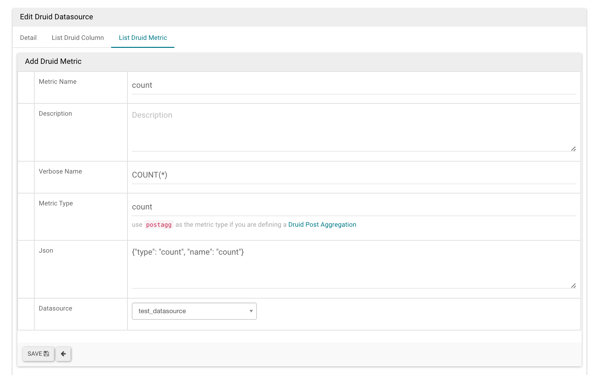

..  Licensed to the Apache Software Foundation (ASF) under one
    or more contributor license agreements.  See the NOTICE file
    distributed with this work for additional information
    regarding copyright ownership.  The ASF licenses this file
    to you under the Apache License, Version 2.0 (the
    "License"); you may not use this file except in compliance
    with the License.  You may obtain a copy of the License at

..    http://www.apache.org/licenses/LICENSE-2.0

..  Unless required by applicable law or agreed to in writing,
    software distributed under the License is distributed on an
    "AS IS" BASIS, WITHOUT WARRANTIES OR CONDITIONS OF ANY
    KIND, either express or implied.  See the License for the
    specific language governing permissions and limitations
    under the License.

Druid
=====

Superset 有一个与 Druid 的本地连接器，而且 Druid 的大部分功能都可以通过 Superset 访问。

.. note ::
    Druid 现在支持 SQL，可以通过 Superset 的 SQLAlchemy 连接器访问。
    long-term vision 是不赞成 Druid 原生 REST connector 的，
    并且只通过 SQL 接口查询 Druid。

聚合
------------

普通的聚合或者 Druid 指标可以在 Superset 中定义和使用。
第一个更简单的用例是在你的数据源的编辑视图中使用 checkbox matrix expose (``Sources -> Druid Datasources ->
[your datasource] -> Edit -> [tab] List Druid Column``) 
单击 ``GroupBy`` 和 ``Filterable`` 复选框将使该列在 explore 视图中显示在相关下拉列表中。
检查 ``Count Distinct``, ``Min``, ``Max`` or ``Sum`` 将导致创建新的指标，
这些指标将在保存数据源时显示在 ``List Druid Metric`` 选项卡中。
通过编辑这些指标，您将注意到它们的 ``json`` 元素对应于 Druid 聚合定义。
您可以从 Druid 文档后面的 ``List Druid Metric`` 选项卡手动创建自己的聚合。

Post-Aggregations
-----------------

Druid 支持 post aggregation ，这在 Superset 中工作。您所要做的就是创建一个指标，
这与手动创建聚合非常相似，但要将 ``postagg`` 指定为 ``Metric Type``。
然后必须在 Json 字段中提供有效的 json post-aggregation 定义（如 Druid 文档中指定的）。

Unsupported Features
--------------------

.. note ::
    Unclear at this point, this section of the documentation could use
    some input.
