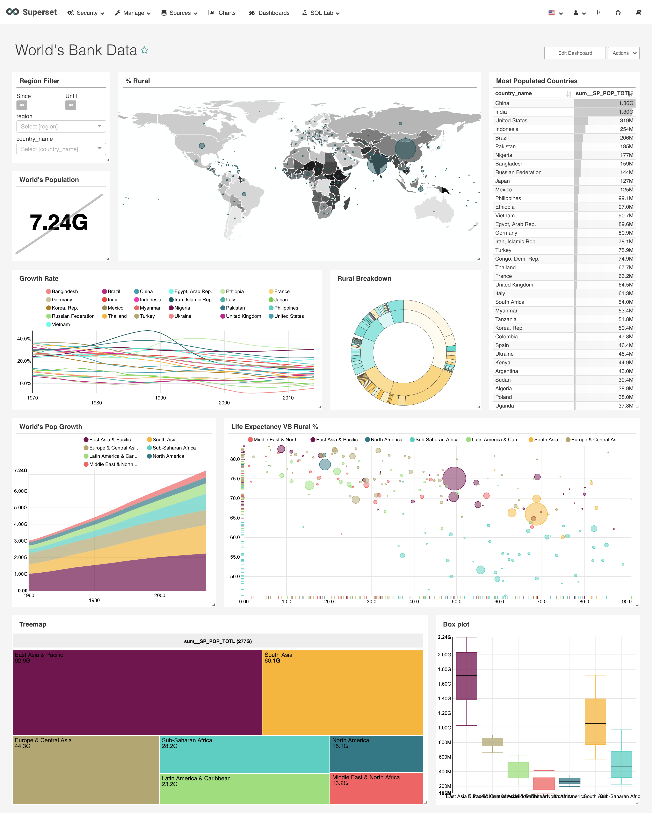
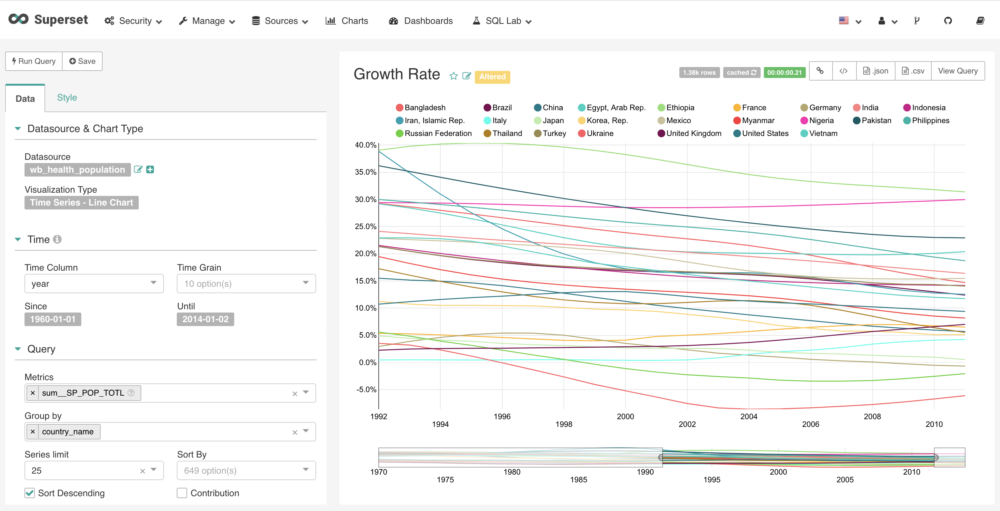
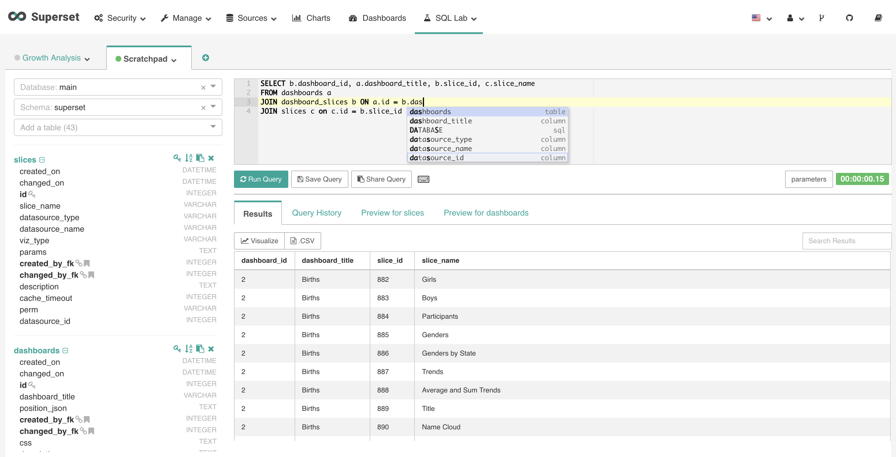

..  Licensed to the Apache Software Foundation (ASF) under one
    or more contributor license agreements.  See the NOTICE file
    distributed with this work for additional information
    regarding copyright ownership.  The ASF licenses this file
    to you under the Apache License, Version 2.0 (the
    "License"); you may not use this file except in compliance
    with the License.  You may obtain a copy of the License at

..    http://www.apache.org/licenses/LICENSE-2.0

..  Unless required by applicable law or agreed to in writing,
    software distributed under the License is distributed on an
    "AS IS" BASIS, WITHOUT WARRANTIES OR CONDITIONS OF ANY
    KIND, either express or implied.  See the License for the
    specific language governing permissions and limitations
    under the License.

|apache_img| |superset_img|

.. |apache_img| image:: images/apache_feather.png
   :width: 7%
   :target: http://www.apache.org/
   :alt: The Apache Software Foundation

.. |superset_img| image:: images/s.png
   :width: 25%

Apache Superset 中文网
''''''''''''''''''''''''''''

Apache Superset 是一个现代的、企业级的商业智能 web 应用程序

----------------

.. Important::

    **Disclaimer**: Apache Superset 是 Apache 软件基金会(ASF)正在孵化的项目，由 Apache 孵化器赞助。所有新接受的项目都需要孵化，直到进一步的审查表明基础设施、通讯和决策过程已经与其他成功的 ASF 项目一致的方式稳定下来。虽然孵化状态不一定反映代码的完整性或稳定性，但它确实表明项目还没有得到 ASF 的完全认可。

.. Note:: Apache Superset, Superset, Apache, Apache feather logo 和 Apache Superset project logo 是 Apache 软件基金会在美国和其他国家的注册商标或商标。

Superset 资源
==================
- `Superset 的 Github <https://github.com/apache/incubator-superset>`_, 注意`我们使用 Github issue 跟踪问题 <https://github.com/apache/incubator-superset/issues>`_
- Superset 的`贡献的指南 <https://github.com/apache/incubator-superset/blob/master/CONTRIBUTING.md>`_和`代码规范 <https://github.com/apache/incubator-superset/blob/master/CODE_OF_CONDUCT.md>`_在 Github 上。
- 我们的 `邮件列表档案 <https://lists.apache.org/list.html?dev@superset.apache.org>`_.要订阅, 请发送电子邮件到 ``dev-subscribe@superset.apache.org``
- `加入我们的 Slack <https://join.slack.com/t/apache-superset/shared_invite/enQtNDMxMDY5NjM4MDU0LWJmOTcxYjlhZTRhYmEyYTMzOWYxOWEwMjcwZDZiNWRiNDY2NDUwNzcwMDFhNzE1ZmMxZTZlZWY0ZTQ2MzMyNTU>`_

Apache 软件基金会资源
====================================
- `Apache 软件基金会网站 <http://www.apache.org>`_
- `时事 <http://www.apache.org/events/current-event>`_
- `许可 <https://www.apache.org/licenses/>`_
- `感谢 <https://www.apache.org/foundation/thanks.html>`_ ASF 的赞助商
- `赞助 Apache! <http://www.apache.org/foundation/sponsorship.html>`_

简介
========

功能
--------

- 丰富的数据可视化
- 易于使用的界面，用于探索和可视化数据
- 创建和共享 Dashboard
- 企业级的身份验证，集成主要身份验证提供者（database, OpenID, LDAP, OAuth & REMOTE_USER 通过 Flask AppBuilder）
- 可扩展的、高粒度的安全/权限模型，允许对谁可以访问单个功能和数据集制定复杂的规则
- 一个简单的语义层，允许用户通过定义哪些字段应该显示在哪个下拉列表中，哪些聚合和功能指标对用户可用来控制数据源在 UI 中的方式
- 集成大多数 SQL-speaking RDBMS，通过 SQLAlchemy 
- 深度集成 Druid.io

数据库
---------

目前支持以下 RDBMS:

- `Amazon Athena <https://aws.amazon.com/athena/>`_
- `Amazon Redshift <https://aws.amazon.com/redshift/>`_
- `Apache Drill <https://drill.apache.org/>`_
- `Apache Druid <http://druid.io/>`_
- `Apache Hive <https://hive.apache.org/>`_
- `Apache Impala <https://impala.apache.org/>`_
- `Apache Kylin <http://kylin.apache.org/>`_
- `Apache Pinot <https://pinot.incubator.apache.org/>`_
- `Apache Spark SQL <https://spark.apache.org/sql/>`_
- `BigQuery <https://cloud.google.com/bigquery/>`_
- `ClickHouse <https://clickhouse.yandex/>`_
- `Elasticsearch <https://www.elastic.co/products/elasticsearch/>`_
- `Exasol <https://www.exasol.com/>`_
- `Google Sheets <https://www.google.com/sheets/about/>`_
- `Greenplum <https://greenplum.org/>`_
- `IBM Db2 <https://www.ibm.com/analytics/db2/>`_
- `MySQL <https://www.mysql.com/>`_
- `Oracle <https://www.oracle.com/database/>`_
- `PostgreSQL <https://www.postgresql.org/>`_
- `Presto <http://prestodb.github.io/>`_
- `Snowflake <https://www.snowflake.com/>`_
- `SQLite <https://www.sqlite.org/>`_
- `SQL Server <https://www.microsoft.com/en-us/sql-server/>`_
- `Teradata <https://www.teradata.com/>`_
- `Vertica <https://www.vertica.com/>`_
- `Hana <https://www.sap.com/products/hana.html>`_

其他数据库引擎，使用合适的 DB-API driver 和 SQLAlchemy dialect 也被支持。

截图
-----------

------

------

------

.. image:: images/screenshots/deckgl_dash.png

------

目录
--------

.. toctree::
    :maxdepth: 2

    installation
    tutorials
    security
    sqllab
    gallery
    druid
    misc
    faq

索引和表
------------------

* :ref:`genindex`
* :ref:`modindex`
* :ref:`search`
