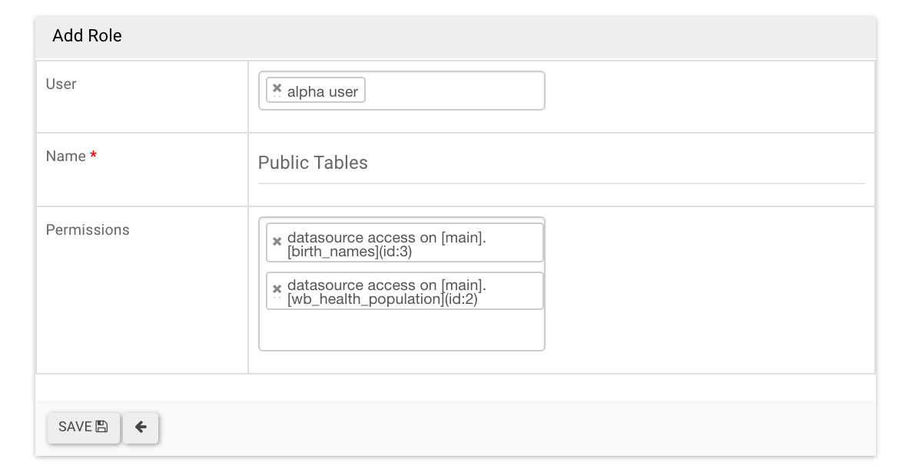

..  Licensed to the Apache Software Foundation (ASF) under one
    or more contributor license agreements.  See the NOTICE file
    distributed with this work for additional information
    regarding copyright ownership.  The ASF licenses this file
    to you under the Apache License, Version 2.0 (the
    "License"); you may not use this file except in compliance
    with the License.  You may obtain a copy of the License at

..    http://www.apache.org/licenses/LICENSE-2.0

..  Unless required by applicable law or agreed to in writing,
    software distributed under the License is distributed on an
    "AS IS" BASIS, WITHOUT WARRANTIES OR CONDITIONS OF ANY
    KIND, either express or implied.  See the License for the
    specific language governing permissions and limitations
    under the License.

安全
========
Superset 中的安全性由 Flask AppBuilder (FAB) 处理。FAB 是“基于 Flask 构建的简单，快速的应用程序开发框架。” 
FAB 提供身份验证，用户管理，权限和角色。请阅读其 `Security documentation
<https://flask-appbuilder.readthedocs.io/en/latest/security.html>`_。

提供角色
--------------
Superset 附带了一组角色，这些角色由 Superset 本身处理。您可以假设这些角色将随着 Superset 的发展而保持最新状态。
即使 ``Admin`` 用户可以这样做，也不建议您通过删除或添加权限来更改这些角色，
因为在运行下一个 ``superset init`` 命令时，这些角色将重新同步为其原始值。

由于不建议您更改此处描述的角色，因此正确地假设您的安全策略应基于这些基本角色和您创建的角色来组成用户访问权限。
例如，您可以创建一个角色 ``Financial Analyst`` ，该角色将由对一组数据源（表）和/或 数据库的一组权限组成。
然后，将为用户授予 ``Gamma`` ，``Financial Analyst`` ，以及 ``sql_lab`` 。

Admin
"""""
管理员拥有所有可能的权限，包括授予或撤销其他用户的权限以及更改其他人的 slices 和 dashboards。

Alpha
"""""
Alpha 用户有权访问所有数据源，但不能授予或撤消其他用户的访问权限。它们还仅限于更改其拥有的对象。
Alpha 用户可以添加和更改数据源。

Gamma
"""""
Gamma 用户的访问权限受到限制。他们只能使用来自其他角色可以访问的数据源中的数据。
他们仅有权查看由他们有权访问的数据源制成的 slices 和 dashboards 。
当前，Gamma 用户无法更改或添加数据源。尽管他们可以创建 slices 和 dashboards ，
但我们假设他们主要是内容消费者。

还要注意，当 Gamma 用户查看 dashboards 和 slices 列表视图时，他们只会看到他们有权访问的对象。

sql_lab
"""""""
``sql_lab`` 角色授予对 SQL Lab 的访问权限。请注意，虽然默认情况下 ``Admin`` 用户可以访问所有数据库，
但 ``Alpha`` 和 ``Gamma`` 用户都需要基于每个数据库进行访问。

Public
""""""
可以允许注销的用户访问某些 Superset 功能。

通过在 ``superset_config.py`` 中设置 ``PUBLIC_ROLE_LIKE_GAMMA = True``，
可以为公共角色授予与 GAMMA 角色相同的权限集。如果要允许匿名用户查看看板，这将很有用。
仍然需要对特定数据集进行显式授予，这意味着您需要编辑 ``Public`` 角色并将 Public 数据源手动添加到角色。

Managing Gamma per data source access
-------------------------------------
Here's how to provide users access to only specific datasets. First make
sure the users with limited access have [only] the Gamma role assigned to
them. Second, create a new role (``Menu -> Security -> List Roles``) and
click the ``+`` sign.

This new window allows you to give this new role a name, attribute it to users
and select the tables in the ``Permissions`` dropdown. To select the data
sources you want to associate with this role, simply click on the dropdown
and use the typeahead to search for your table names.

You can then confirm with your Gamma users that they see the objects
(dashboards and slices) associated with the tables related to their roles.

Customizing
-----------

The permissions exposed by FAB are very granular and allow for a great level
of customization. FAB creates many permissions automagically for each model
that is created (can_add, can_delete, can_show, can_edit, ...) as well as for
each view. On top of that, Superset can expose more granular permissions like
``all_datasource_access``.

We do not recommend altering the 3 base roles as there
are a set of assumptions that Superset is built upon. It is possible though for
you to create your own roles, and union them to existing ones.

Permissions
"""""""""""

Roles are composed of a set of permissions, and Superset has many categories
of permissions. Here are the different categories of permissions:

- **Model & action**: models are entities like ``Dashboard``,
  ``Slice``, or ``User``. Each model has a fixed set of permissions, like
  ``can_edit``, ``can_show``, ``can_delete``, ``can_list``, ``can_add``, and
  so on. By adding ``can_delete on Dashboard`` to a role, and granting that
  role to a user, this user will be able to delete dashboards.
- **Views**: views are individual web pages, like the ``explore`` view or the
  ``SQL Lab`` view. When granted to a user, he/she will see that view in its menu items, and be able to load that page.
- **Data source**: For each data source, a permission is created. If the user
  does not have the ``all_datasource_access`` permission granted, the user
  will only be able to see Slices or explore the data sources that are granted
  to them
- **Database**: Granting access to a database allows for the user to access
  all data sources within that database, and will enable the user to query
  that database in SQL Lab, provided that the SQL Lab specific permission
  have been granted to the user

Restricting access to a subset of data sources
""""""""""""""""""""""""""""""""""""""""""""""

The best way to go is probably to give user ``Gamma`` plus one or many other
roles that would add access to specific data sources. We recommend that you
create individual roles for each access profile. Say people in your finance
department might have access to a set of databases and data sources, and
these permissions can be consolidated in a single role. Users with this
profile then need to be attributed ``Gamma`` as a foundation to the models
and views they can access, and that ``Finance`` role that is a collection
of permissions to data objects.

One user can have many roles, so a finance executive could be granted
``Gamma``, ``Finance``, and perhaps another ``Executive`` role that gather
a set of data sources that power dashboards only made available to executives.
When looking at its dashboard list, this user will only see the
list of dashboards it has access to, based on the roles and
permissions that were attributed.
