..  Licensed to the Apache Software Foundation (ASF) under one
    or more contributor license agreements.  See the NOTICE file
    distributed with this work for additional information
    regarding copyright ownership.  The ASF licenses this file
    to you under the Apache License, Version 2.0 (the
    "License"); you may not use this file except in compliance
    with the License.  You may obtain a copy of the License at

..    http://www.apache.org/licenses/LICENSE-2.0

..  Unless required by applicable law or agreed to in writing,
    software distributed under the License is distributed on an
    "AS IS" BASIS, WITHOUT WARRANTIES OR CONDITIONS OF ANY
    KIND, either express or implied.  See the License for the
    specific language governing permissions and limitations
    under the License.

使用 Apache Superset 研究数据
===================================

在本教程中，我们将通过研究一个真实的数据集来介绍 Apache Superset 中的关键概念，
该数据集包含一个英国组织的员工在2011年的飞行。每趟航班的信息如下:

-  旅客部门。在本教程中，部门已重命名为“橙色”，“黄色”和“紫色”。
-  机票费用。
-  旅游舱（经济舱，高级经济舱，商务舱和头等舱）。
-  票是单张还是回程。
-  旅行日期。
-  有关始发地和目的地的信息。
-  起点和终点之间的距离，以公里（km）为单位。

启用上传 CSV 功能
-----------------------------------

您可能需要启用将 CSV 上传到数据库的功能。以下部分说明了如何为示例数据库启用此功能。

在顶部菜单中，`Sources --> Databases`。 在列表中找到 :guilabel:`examples` ，然后选择编辑记录按钮。

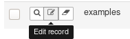

在 :guilabel:`Edit Database` 页面中，选中 :guilabel:`Allow Csv Upload` 复选框。

最后，通过选择页面底部的 :guilabel:`Save` 进行保存。

获取并加载数据
------------------------------

从 `Github <https://raw.githubusercontent.com/apache-superset/examples-data/master/tutorial_flights.csv>`__ 将本教程的数据下载到您的计算机。

在顶部菜单中，选择 :menuselection:`Sources --> Upload a CSV` 。

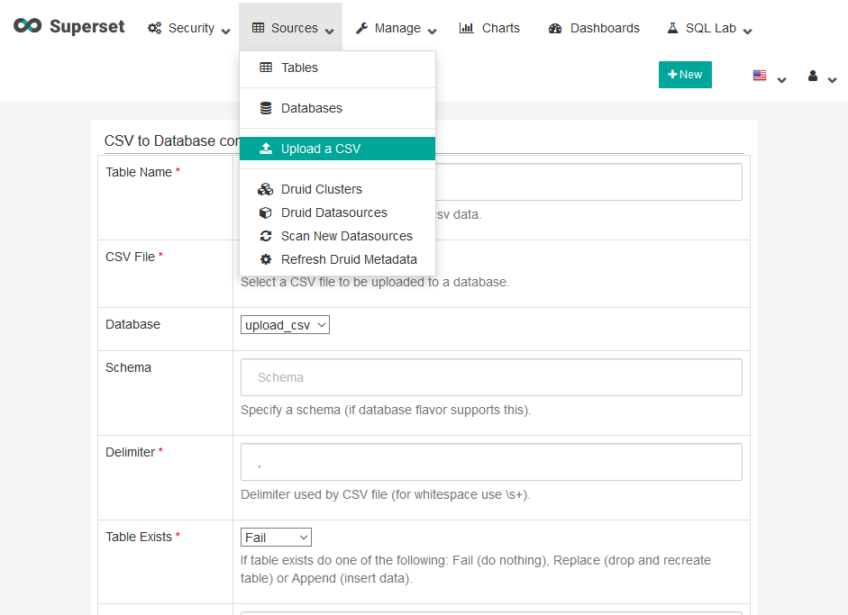

然后，输入 :guilabel:`Table name` 为 `tutorial_flights` ，然后从计算机中选择 :guilabel:`CSV file` 。

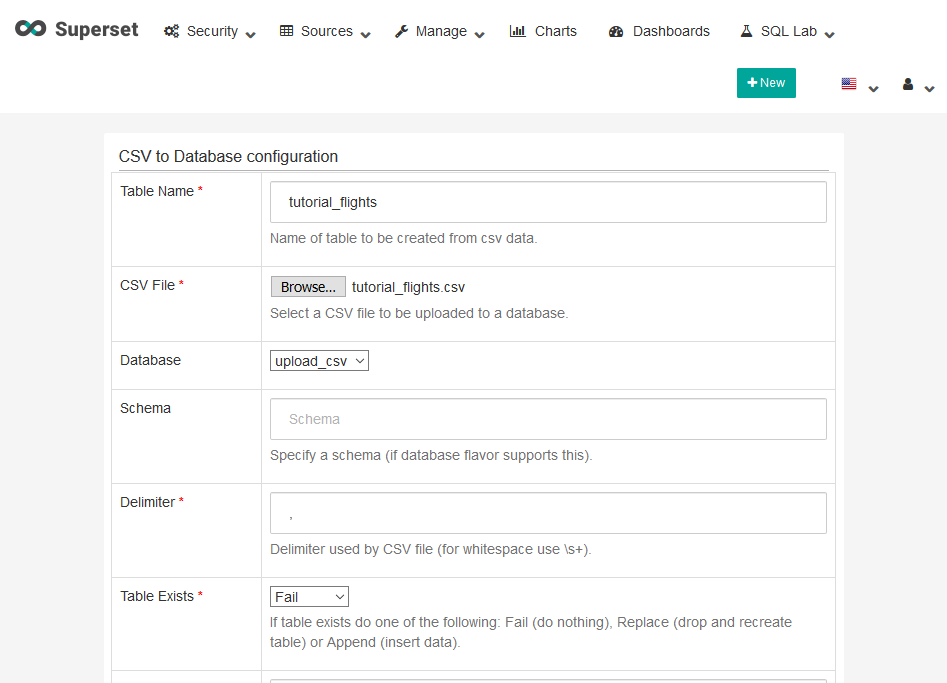

接下来，在 :guilabel:`Parse Dates` 字段中输入文本 `Travel Date`。

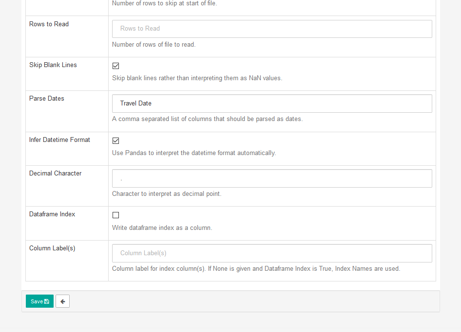

将所有其他选项保留为默认设置，然后选择页面底部的 :guilabel:`Save` 。

表格可视化
-------------------

在本部分中，我们将创建我们的第一个可视化文件：一个表格，以显示航班数量和每次旅行的费用。

要创建新图表，请选择 :menuselection:`New --> Chart`。

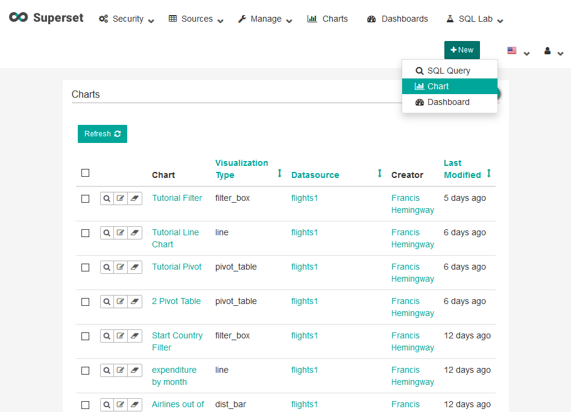

在 `Create a new chart` 对话框中，从 :guilabel:`Chose a datasource` 下拉列表中选择 :guilabel:`tutorial_flights` 。

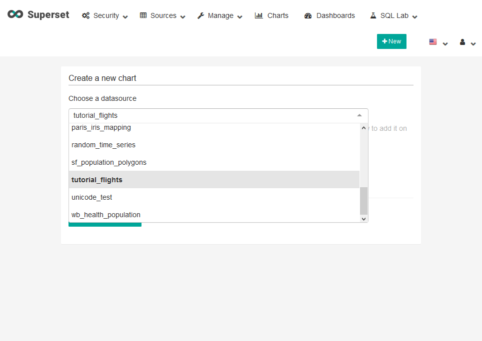

接下来，选择可视化类型为 :guilabel:`Table` 。

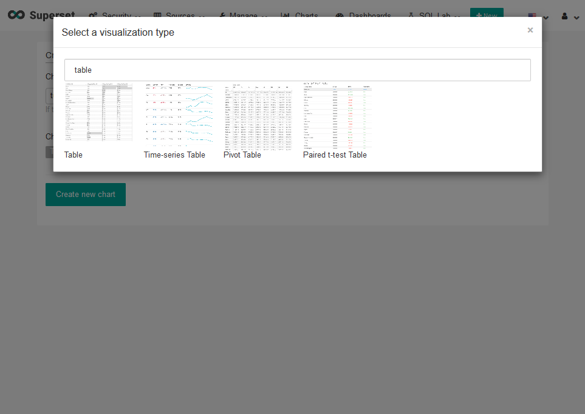

然后，选择 :guilabel:`Create new chart` 以进入图表视图。

默认情况下，Apache Superset 仅显示数据的最后一周：在我们的示例中，我们要查看数据集中的所有数据。 
没问题 - 在 :guilabel:`Time` 部分中，通过选择 :guilabel:`Last week` 然后将选择更改
为 :guilabel:`No filter`，从而在 :guilabel:`Time range` 上删除过滤器，最后按 :guilabel:`OK` 确认选择。

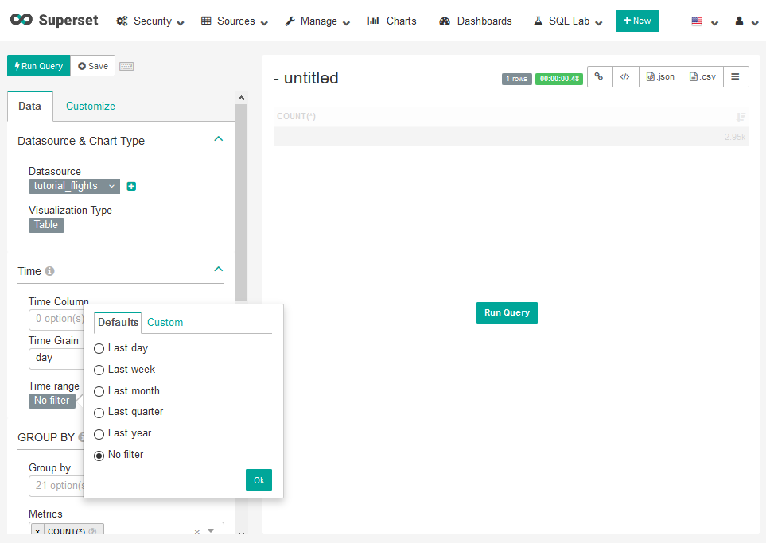

现在，我们要使用 :guilabel:`Group by` 选项在表中指定行。由于在此示例中，
我们想了解不同的旅行舱位，因此在此菜单中选择 :guilabel:`Travel Class` 。

接下来，我们可以使用 :guilabel:`Metrics` 选项指定我们希望在表格中看到的指标。
:guilabel:`Count(*)` 已经存在，它表示表中的行数（在这种情况下，它对应于航班数，因为我们每个航班都有一行）。 
要添加成本，请在 :guilabel:`Metrics` 中选择 :guilabel:`Cost`。:guilabel:`Save` 默认的聚合选项，即对列求和。

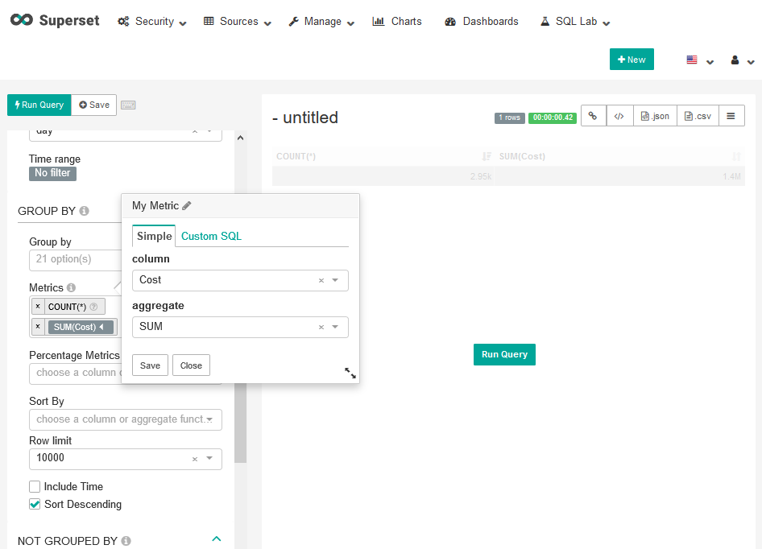

最后，选择 :guilabel:`Run Query` 以查看表的结果。

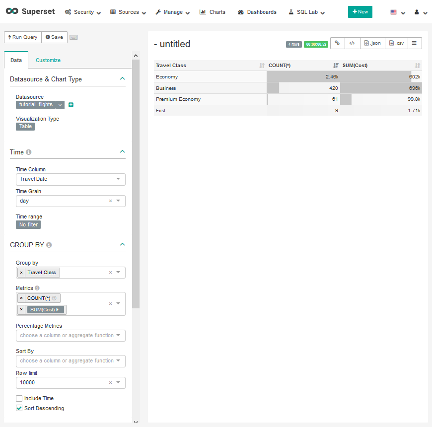

恭喜，您已经在 Apache Superset 中创建了您的第一个可视化！

要保存可视化，请单击屏幕左上方的 :guilabel:`Save` 。选择 :guilabel:`Save as` 选项，
然后将图表名称输入为 Tutorial Table（您将能够通过 :guilabel:`Charts` 屏再次找到它，可从顶部菜单访问）。
同样，选择 :guilabel:`Add to new dashboard` ，然后输入 `Tutorial Dashboard`。
最后，选择 :guilabel:`Save & go to dashboard`。

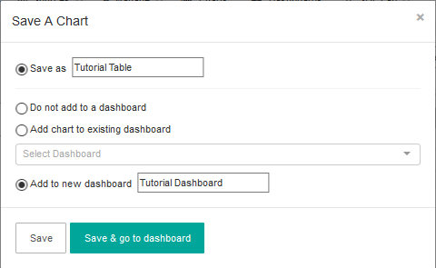

看板基础
----------------

接下来，我们将探索看板界面。如果您已按照上一节进行操作，则应该已经打开了看板。
否则，您可以通过选择顶部菜单上的 :guilabel:`Dashboards` ，
然后从看板列表中选择 :guilabel:`Tutorial dashboard` 来导航到看板。

在该看板上，您应该看到在上一节中创建的表。选择 :guilabel:`Edit dashboard` ，然后将鼠标悬停在表格上。
通过选择表格的右下角（光标也会改变），您可以通过拖放来调整其大小。

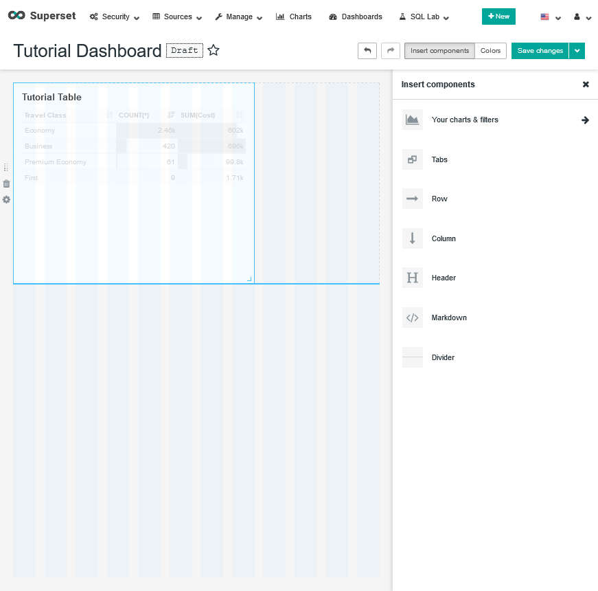

最后，通过选择右上角的 :guilabel:`Save changes` 来保存更改。

透视表
-----------

在本节中，我们将使用更复杂的可视化数据透视表扩展分析。
在本节的最后，您将创建了一个表，该表显示按部门，按旅行舱划分的前六个月的每月航班支出。

和以前一样，通过选择顶部菜单上的 :menuselection:`New --> Chart` 来创建新的可视化。
再次选择 tutorial_flights 作为数据源，然后单击可视化类型以转到可视化菜单。
选择 :guilabel:`Pivot Table` 可视化（可以通过在搜索框中输入文本进行筛选），
然后 :guilabel:`Create a new chart`。

在 :guilabel:`Time` 部分中，将 Time Column 保留为 Travel Date
（由于我们的数据集中只有一个时间列，因此会自动选择该列）。然后，
将 :guilabel:`Time Grain` 选择为 month，因为每天的数据过于精细而无法查看模式。
然后，通过单击 :guilabel:`Time Range` 部分中的 Last week，
将时间范围选择为2011年的前六个月，然后在 :guilabel:`Custom` 中直接输入日期
或使用日历小部件分别选择 :guilabel:`Start / end`, 1\ :sup:`st` January 2011 和
30\ :sup:`th` June 2011（通过选择月份名称然后选择年份，可以更快地移动到较远的日期）。

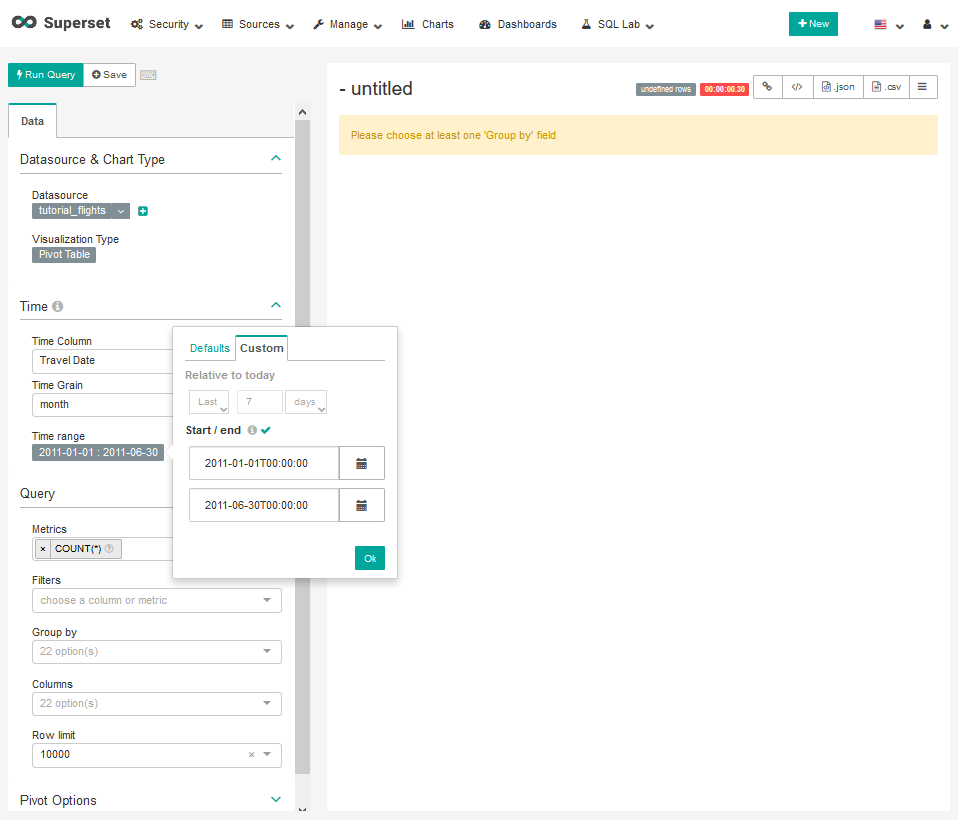

接下来，在 :guilabel:`Query` 部分中，删除默认的 COUNT(*) 并添加 Cost，以保持默认的 SUM aggregate。
请注意，Apache Superset 将通过列表左侧列上的符号指示度量标准的类型
（ABC 表示字符串，＃ 表示数字，a clock face 表示时间等等）。

在 :guilabel:`Group by` 中选择 :guilabel:`Time`：
这将自动使用 Time Column 和我们在 Time 部分中定义的 Time Grain selections。

在 :guilabel:`Columns` 中，首先选择 :guilabel:`Department`，
然后选择 :guilabel:`Travel Class`。全部设置好了 - 让我们 :guilabel:`Run Query` 来查看一些数据！

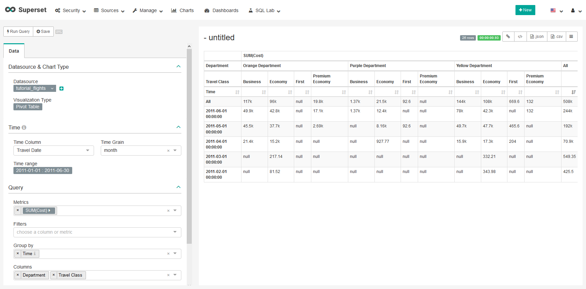

您应该在行中看到 months，在列中看到 Department 和 Travel Class。
在我们的看板中，选择 :guilabel:`Save` ，
命名图表 Tutorial Pivot 并使用
:guilabel:`Add chart to existing dashboard`
选择 :guilabel:`Tutorial Dashboard`,
最后 :guilabel:`Save & go to dashboard`。

折线图
----------

在本节中，我们将创建一个折线图，以了解整个数据集上按月计算的机票平均价格。
和之前一样，选择 :menuselection:`New --> Chart` ,然后
:guilabel:`tutorial_flights` 作为数据源和 :guilabel:`Line Chart` 作为可视化类型。

与以前一样，在 Time 部分中，将 :guilabel:`Time Column` 保留为 Travel Date，
将 :guilabel:`Time Grain` 保留为 month，但是这次在 :guilabel:`Time range` 中
选择 :guilabel:`No filter`，因为我们要查看整个数据集。

在 :guilabel:`Metrics` 中，删除默认的 :guilabel:`COUNT(*)` 并添加 :guilabel:`Cost`。
这一次，我们希望更改这个列的聚合方式，以显示平均值:
我们可以通过在 :guilabel:`aggregate` 下拉菜单中选择 :guilabel:`AVG` 来实现这一点。

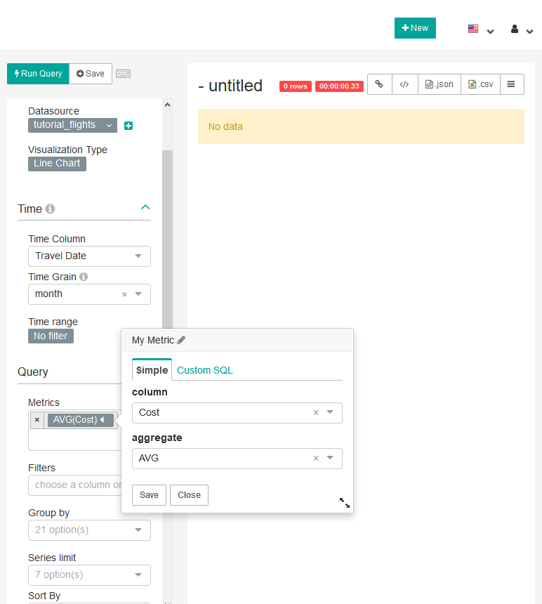

接下来，选择 :guilabel:`Run Query` 来显示图表上的数据。

How does this look? Well, we can see that the average cost goes up in
December. However, perhaps it doesn’t make sense to combine both single
and return tickets, but rather show two separate lines for each ticket
type.

Let’s do this by selecting :guilabel:`Ticket Single or Return` in the
:guilabel:`Group by` box, and the selecting :guilabel:`Run Query` again.
Nice! We can see that on average single tickets are cheaper than returns
and that the big spike in December is caused by return tickets.

Our chart is looking pretty good already, but let’s customize some more
by going to the :guilabel:`Customize` tab on the left hand pane. Within
this pane, try changing the :guilabel:`Color Scheme`, removing the range
filter by selecting No in the :guilabel:`Show Range Filter` drop down
and adding some labels using :guilabel:`X Axis Label` and
:guilabel:`Y Axis Label`.

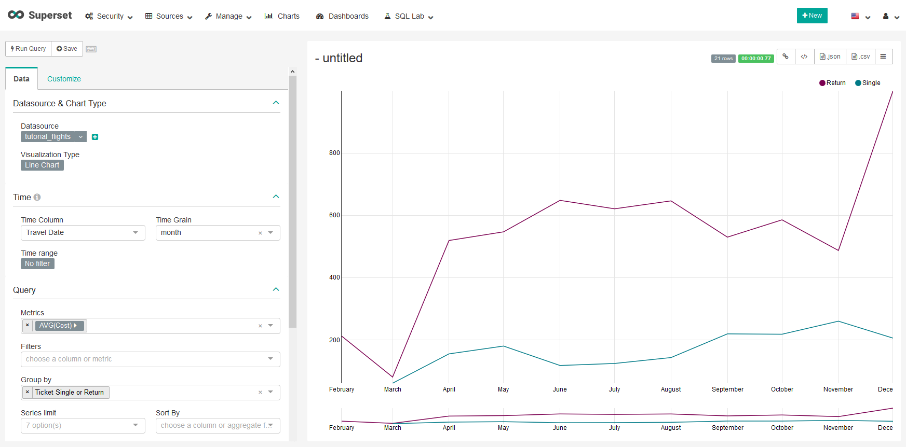

Once you’re done, :guilabel:`Save` as Tutorial Line Chart, use
:guilabel:`Add chart to
existing dashboard` to add this chart to the previous ones on the
Tutorial Dashboard and then :guilabel:`Save & go to dashboard`.

Markup
------

In this section, we will add some text to our dashboard. If you’re there
already, you can navigate to the dashboard by selecting
:guilabel:`Dashboards` on the top menu, then
:guilabel:`Tutorial dashboard` from the list of dashboards. Got into
edit mode by selecting :guilabel:`Edit dashboard`.

Within the Insert components pane, drag and drop a :guilabel:`Markdown`
box on the dashboard. Look for the blue lines which indicate the anchor
where the box will go.

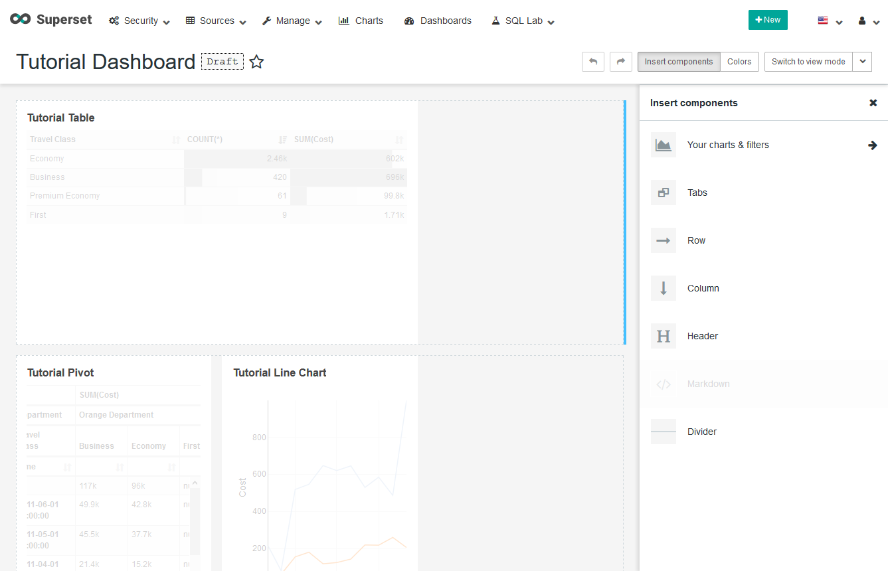

Now, to edit the text, select the box. You can enter text, in markdown
format (see `this Markdown
Cheatsheet <https://github.com/adam-p/markdown-here/wiki/Markdown-Cheatsheet>`__
for more information about this format). You can toggle between
:guilabel:`Edit` and :guilabel:`Preview` using the menu on the top of
the box.

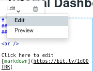

To exit, select any other part of the dashboard. Finally, don’t forget
to keep your changes using :guilabel:`Save changes`.

Filter box
----------

In this section, you will learn how to add a filter to your dashboard.
Specifically, we will create a filter that allows us to look at those
flights that depart from a particular country.

A filter box visualization can be created as any other visualization by
selecting :menuselection:`New --> Chart`, and then
:guilabel:`tutorial_flights` as the datasource and
:guilabel:`Filter Box` as the visualization type.

First of all, in the :guilabel:`Time` section, remove the filter from
the :guilabel:`Time
range` selection by selecting :guilabel:`No filter`.

Next, in :guilabel:`Filters Configurations` first add a new filter by
selecting the plus sign and then edit the newly created filter by
selecting the pencil icon.

For our use case, it makes most sense to present a list of countries in
alphabetical order. First, enter the column as
:guilabel:`Origin Country` and keep all other options the same and then
select :guilabel:`Run Query`. This gives us a preview of our filter.

Next, remove the date filter by unchecking the :guilabel:`Date Filter`
checkbox.

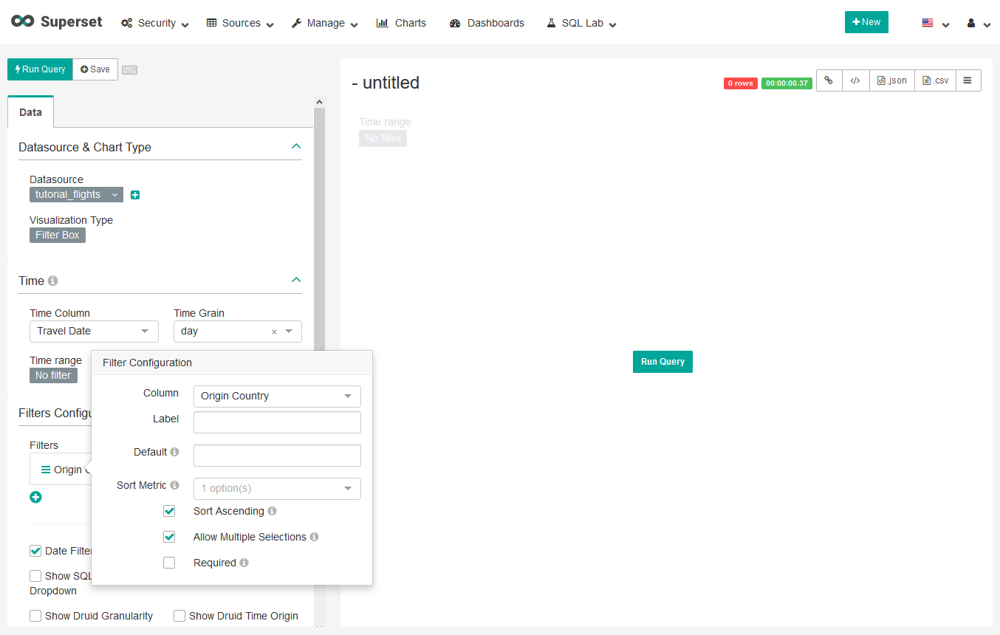

Finally, select :guilabel:`Save`, name the chart as Tutorial Filter, add
the chart to our existing Tutorial Dashboard and then
:guilabel:`Save & go to
dashboard`. Once on the Dashboard, try using the filter to show only
those flights that departed from the United Kingdom – you will see the
filter is applied to all of the other visualizations on the dashboard.

Publishing your dashboard
-------------------------

If you have followed all of the steps outlined in the previous section,
you should have a dashboard that looks like the below. If you would
like, you can rearrange the elements of the dashboard by selecting
:guilabel:`Edit dashboard` and dragging and dropping.

If you would like to make your dashboard available to other users,
simply select :guilabel:`Draft` next to the title of your dashboard on
the top left to change your dashboard to be in :guilabel:`Published`
state. You can also favorite this dashboard by selecting the star.

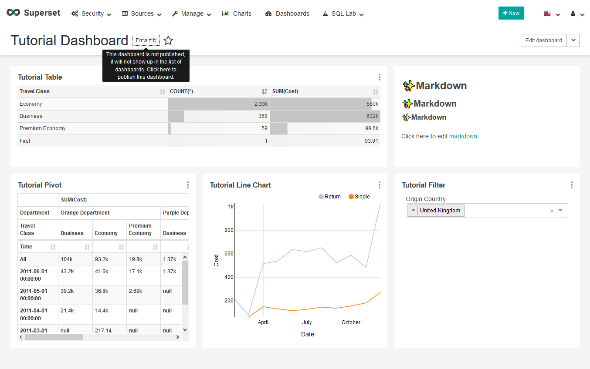

Taking your dashboard further
-----------------------------

In the following sections, we will look at more advanced Apache Superset
topics.

Annotations
-----------

Annotations allow you to add additional context to your chart. In this
section, we will add an annotation to the Tutorial Line Chart we made in
a previous section. Specifically, we will add the dates when some
flights were cancelled by the UK's Civil Aviation Authority in response
to the eruption of the Grímsvötn volcano in Iceland (23-25 May 2011).

First, add an annotation layer by navigating to
:menuselection:`Manage --> Annotation Layers`. Add a new annotation
layer by selecting the green plus sign to add a new record. Enter the
name Volcanic Eruptions and save. We can use this layer to refer to a
number of different annotations.

Next, add an annotation by navigating to
:menuselection:`Manage --> Annotations` and then create a new annotation
by selecting the green plus sign. Then, select the
:guilabel:`Volcanic Eruptions` layer, add a short description Grímsvötn
and the eruption dates (23-25 May 2011) before finally saving.

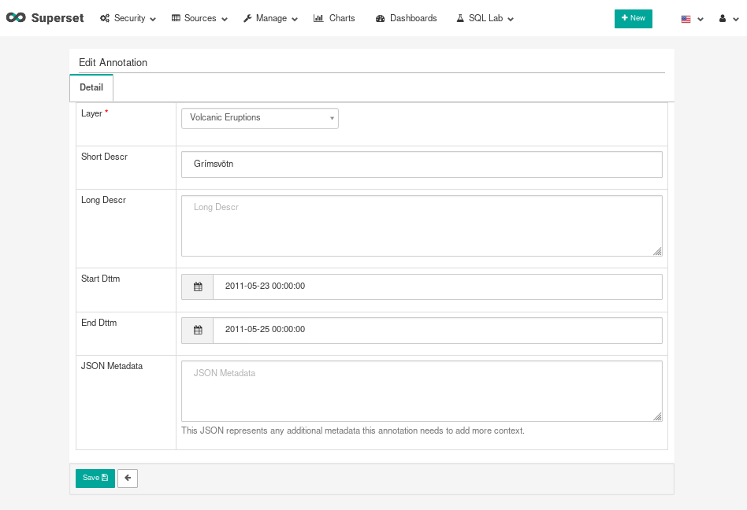

Then, navigate to the line chart by going to :guilabel:`Charts` then
selecting :guilabel:`Tutorial
Line Chart` from the list. Next, go to the
:guilabel:`Annotations and Layers` section and select
:guilabel:`Add Annotation Layer`. Within this dialogue:

- name the layer as `Volcanic Eruptions`
- change the :guilabel:`Annotation Layer Type` to :guilabel:`Event`
- set the :guilabel:`Annotation Source` as :guilabel:`Superset annotation` 
- specify the :guilabel:`Annotation Layer` as :guilabel:`Volcanic Eruptions`

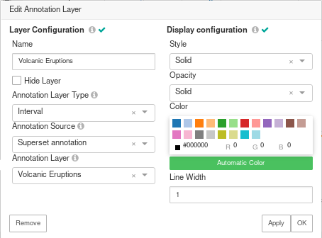

Select :guilabel:`Apply` to see your annotation shown on the chart.

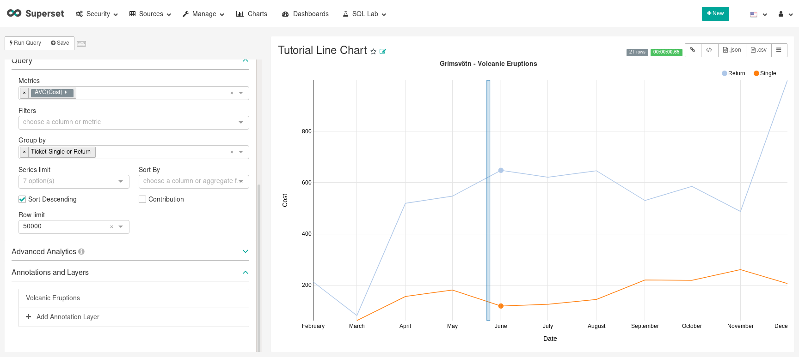

If you wish, you can change how your annotation looks by changing the
settings in the :guilabel:`Display configuration` section. Otherwise,
select :guilabel:`OK` and finally :guilabel:`Save` to save your chart.
If you keep the default selection to overwrite the chart, your
annotation will be saved to the chart and also appear automatically in
the Tutorial Dashboard.

Advanced Analytics
------------------

In this section, we are going to explore the Advanced Analytics feature
of Apache Superset that allows you to apply additional transformations
to your data. The three types of transformation are:

Moving Average
  Select a rolling window [#f1]_, and then apply a calculation on it (mean,
  sum or standard deviation). The fourth option, cumsum, calculates the
  cumulative sum of the series [#f2]_.

Time Comparison
  Shift your data in time and, optionally, apply a calculation to compare the
  shifted data with your actual data (e.g. calculate the absolute difference
  between the two).

Python Functions
  Resample your data using one of a variety of methods [#f3]_.

Setting up the base chart
~~~~~~~~~~~~~~~~~~~~~~~~~

In this section, we're going to set up a base chart which we can then
apply the different Advanced Analytics features to. Start off by
creating a new chart using the same :guilabel:`tutorial_flights`
datasource and the :guilabel:`Line Chart` visualization type. Within the
Time section, set the :guilabel:`Time Range` as 1\ :sup:`st` October
2011 and 31\ :sup:`st` October 2011.

Next, in the query section, change the :guilabel:`Metrics` to the sum of
:guilabel:`Cost`. Select :guilabel:`Run Query` to show the chart. You
should see the total cost per day for each month in October 2011.

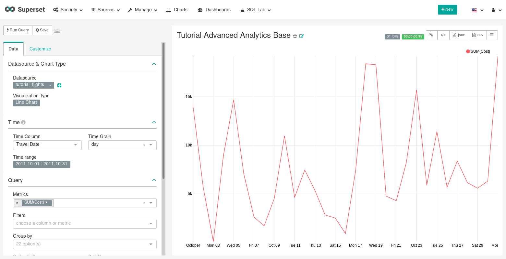

Finally, save the visualization as Tutorial Advanced Analytics Base,
adding it to the Tutorial Dashboard.

Rolling mean
~~~~~~~~~~~~

There is quite a lot of variation in the data, which makes it difficult
to identify any trend. One approach we can take is to show instead a
rolling average of the time series. To do this, in the
:guilabel:`Moving Average` subsection of :guilabel:`Advanced Analytics`,
select mean in the :guilabel:`Rolling` box and enter 7 into both Periods
and Min Periods. The period is the length of the rolling period
expressed as a multiple of the :guilabel:`Time Grain`. In our example,
the :guilabel:`Time Grain` is day, so the rolling period is 7 days, such
that on the 7th October 2011 the value shown would correspond to the
first seven days of October 2011. Lastly, by specifying
:guilabel:`Min Periods` as 7, we ensure that our mean is always
calculated on 7 days and we avoid any ramp up period.

After displaying the chart by selecting :guilabel:`Run Query` you will
see that the data is less variable and that the series starts later as
the ramp up period is excluded.

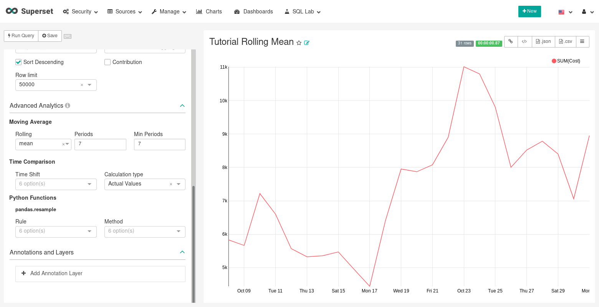

Save the chart as Tutorial Rolling Mean and add it to the Tutorial
Dashboard.

Time Comparison
~~~~~~~~~~~~~~~

In this section, we will compare values in our time series to the value
a week before. Start off by opening the Tutorial Advanced Analytics Base
chart, by going to :guilabel:`Charts` in the top menu and then selecting
the visualization name in the list (alternatively, find the chart in the
Tutorial Dashboard and select Explore chart from the menu for that
visualization).

Next, in the :guilabel:`Time Comparison` subsection of
:guilabel:`Advanced Analytics`, enter the :guilabel:`Time Shift` by
typing in "minus 1 week" (note this box accepts input in natural
language). :guilabel:`Run Query` to see the new chart, which has an
additional series with the same values, shifted a week back in time.

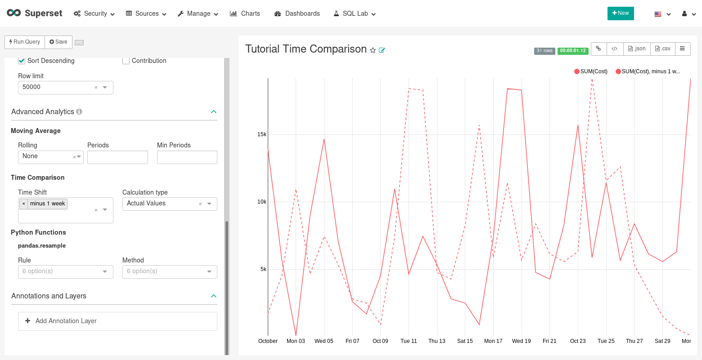

Then, change the :guilabel:`Calculation type` to
:guilabel:`Absolute difference` and select :guilabel:`Run
Query`. We can now see only one series again, this time showing the
difference between the two series we saw previously.

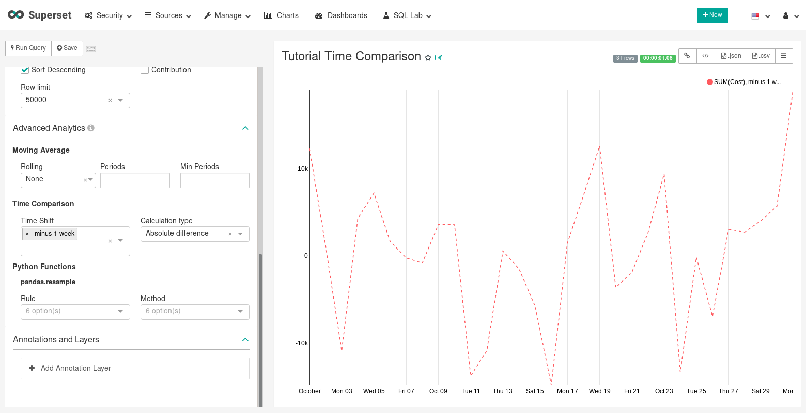

Save the chart as Tutorial Time Comparison and add it to the Tutorial
Dashboard.

Resampling the data
~~~~~~~~~~~~~~~~~~~

In this section, we'll resample the data so that rather than having
daily data we have weekly data. As in the previous section, reopen the
Tutorial Advanced Analytics Base chart.

Next, in the :guilabel:`Python Functions` subsection of
:guilabel:`Advanced Analytics`, enter 7D, corresponding to seven days,
in the :guilabel:`Rule` and median as the :guilabel:`Method` and show
the chart by selecting :guilabel:`Run Query`.

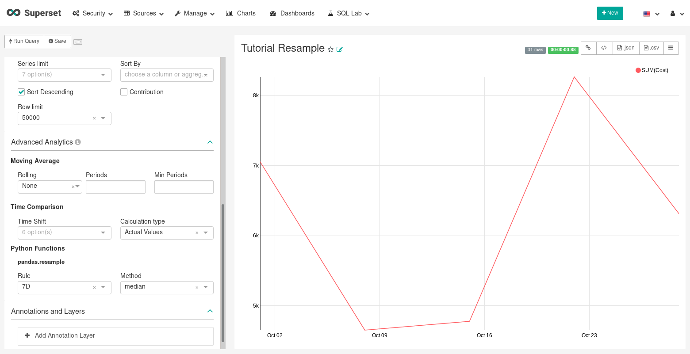

Note that now we have a single data point every 7 days. In our case, the
value showed corresponds to the median value within the seven daily data
points. For more information on the meaning of the various options in
this section, refer to the `Pandas
documentation <https://pandas.pydata.org/pandas-docs/stable/reference/api/pandas.DataFrame.resample.html>`__.

Lastly, save your chart as Tutorial Resample and add it to the Tutorial
Dashboard. Go to the tutorial dashboard to see the four charts side by
side and compare the different outputs.

.. rubric:: Footnotes

.. [#f1] See the Pandas `rolling method documentation <https://pandas.pydata.org/pandas-docs/stable/reference/api/pandas.DataFrame.rolling.html>`_ for more information.
.. [#f2] See the Pandas `cumsum method documentation <https://pandas.pydata.org/pandas-docs/stable/reference/api/pandas.DataFrame.cumsum.html>`_ for more information.
.. [#f3] See the Pandas `resample method documentation <https://pandas.pydata.org/pandas-docs/stable/reference/api/pandas.DataFrame.resample.html>`_ for more information.

